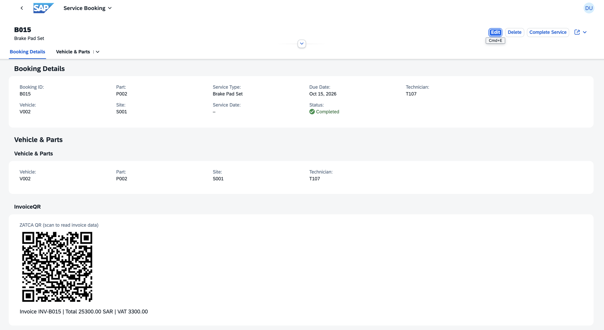
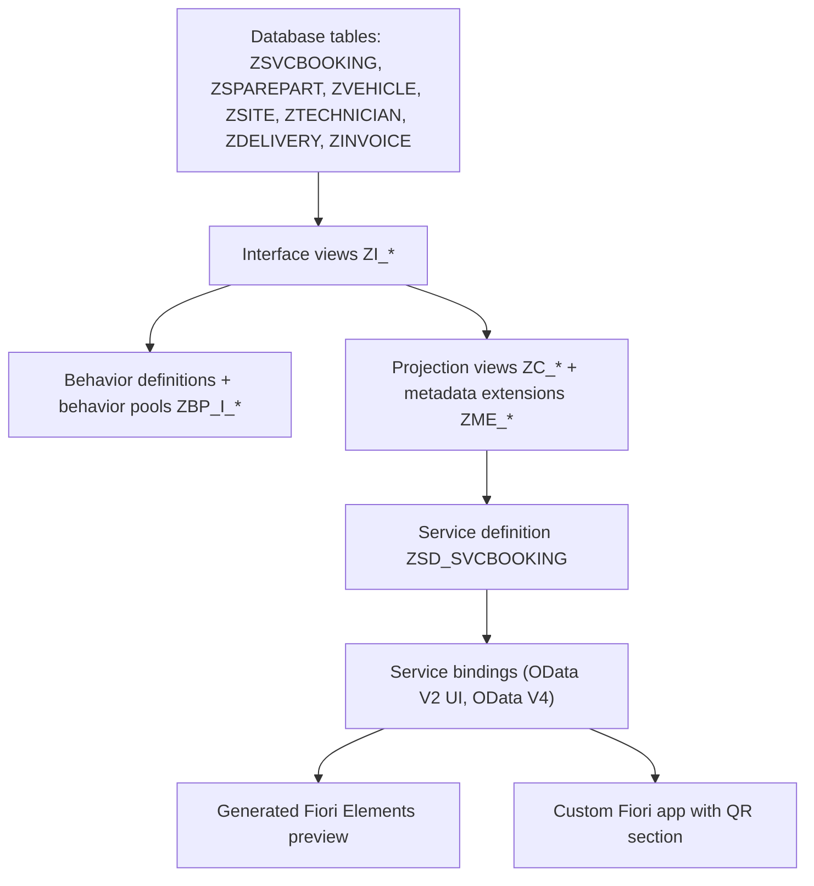
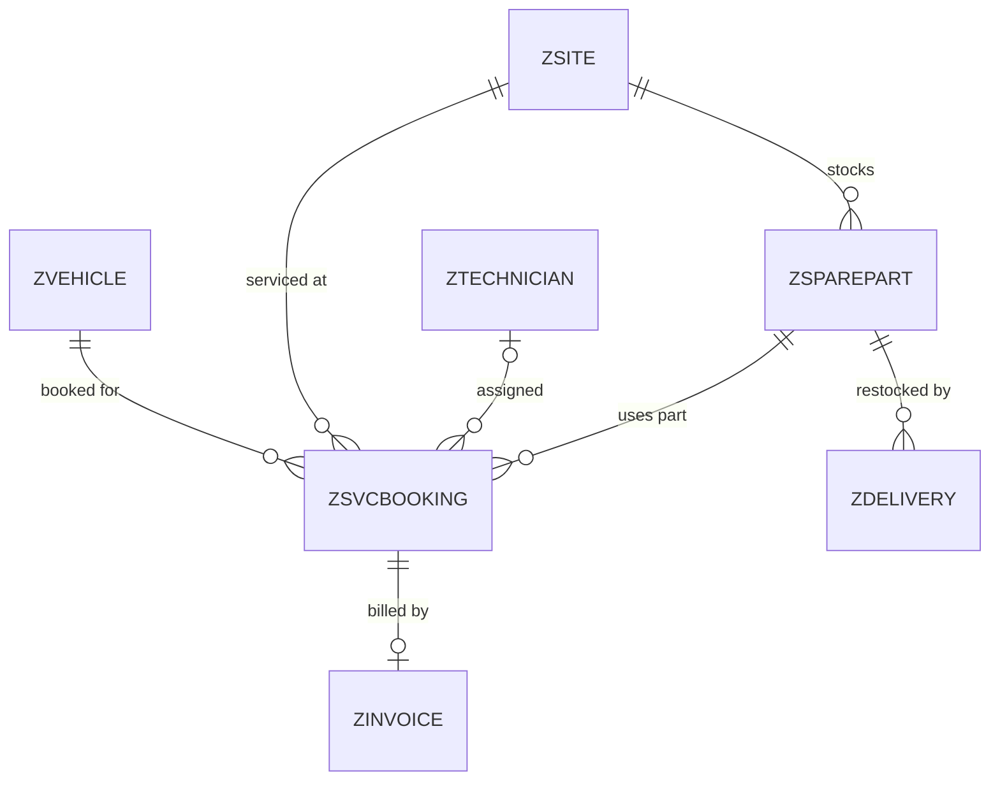
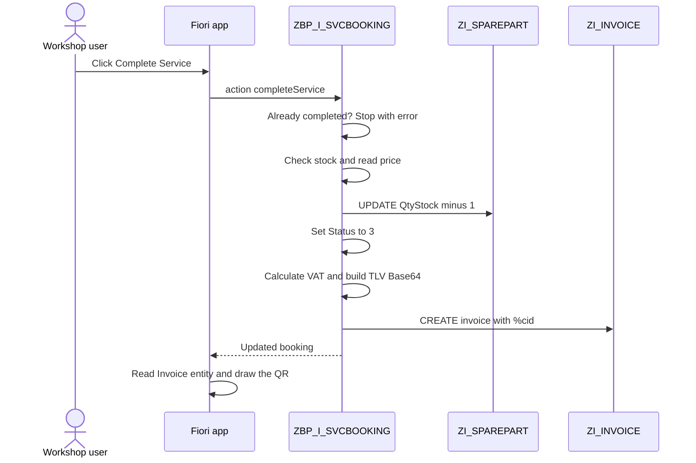
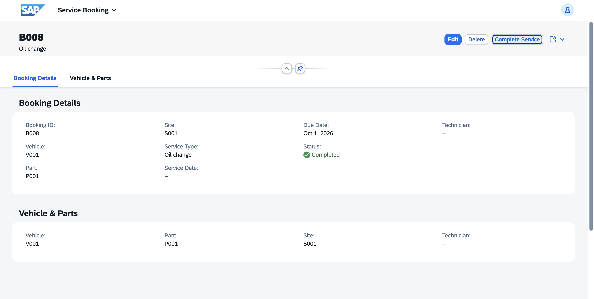
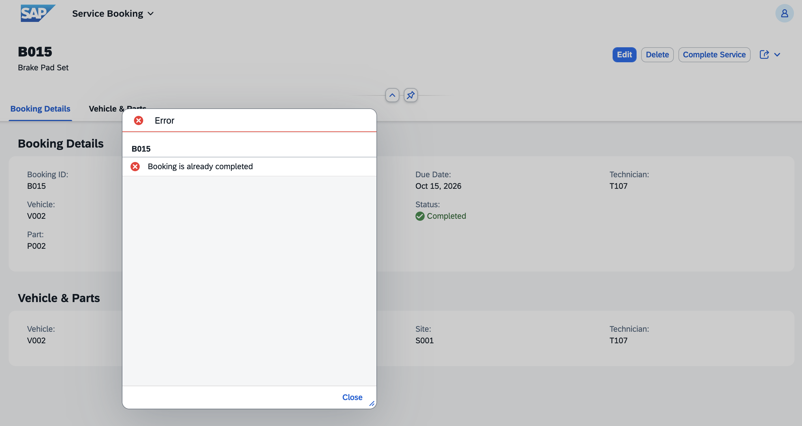
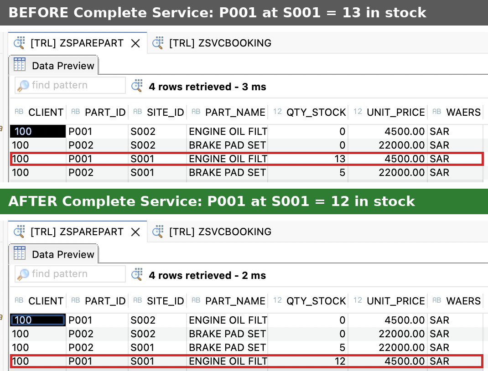
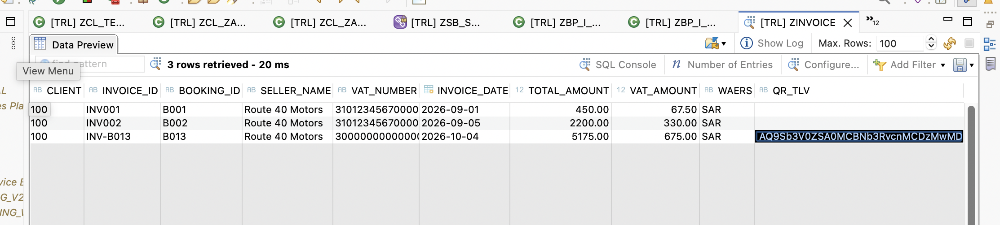

# Route 40 Motors: Service Booking, Stock & ZATCA-style Invoicing

A workshop aftersales application built on the **SAP BTP ABAP Environment** with the **ABAP RESTful Application Programming Model (RAP)**, **CDS**, and **SAP Fiori**. It is themed on a multi-site car workshop in Saudi Arabia.

A customer's vehicle is booked for service. Each booking reserves a spare part at a specific site. The back end refuses a booking if that part is not in stock there. When a job is finished, one click on **Complete Service** deducts the stock, closes the booking, and issues an invoice carrying a **ZATCA-style QR code** (the Phase 1 TLV format) that is drawn right on the booking page.



> All sample data in this repository is fictional. This is a learning and portfolio project, **not** a certified e-invoicing solution (see [Scope and limitations](#scope-and-limitations)).

**Author:** Sharfunisa Shajahan · [GitHub](https://github.com/Nishaweb-developer) · [Portfolio](https://nishaweb-developer.github.io/myworks)

---

## Table of contents

1. [What it does](#what-it-does)
2. [Architecture](#architecture)
3. [Repository structure](#repository-structure)
4. [Data model](#data-model)
5. [Feature deep dives](#feature-deep-dives)
   - [Service bookings and stock validation](#1-service-bookings-and-stock-validation)
   - [Input normalisation](#2-input-normalisation)
   - [Complete Service action](#3-complete-service-action)
   - [ZATCA-style invoice and QR text](#4-zatca-style-invoice-and-qr-text)
   - [Fiori app with a custom QR section](#5-fiori-app-with-a-custom-qr-section)
   - [Deliveries](#6-deliveries)
   - [Saudization report](#7-saudization-report)
6. [OData services](#odata-services)
7. [Tech stack](#tech-stack)
8. [Run it yourself](#run-it-yourself)
9. [Testing](#testing)
10. [Lessons learned](#lessons-learned)
11. [Troubleshooting](#troubleshooting)
12. [Scope and limitations](#scope-and-limitations)
13. [Roadmap](#roadmap)
14. [Credits and license](#credits-and-license)

---

## What it does

| Area | Capability | Status |
|---|---|---|
| Bookings | List report and object page with create, edit, delete | Built |
| Stock validation | Server-side `checkStock` blocks a booking when the part is missing at the site or out of stock | Built |
| Input hygiene | Part, site, department and nationality are normalised to upper case on save | Built |
| Complete Service | One action: deducts stock, sets status to *Completed*, creates the invoice | Built |
| E-invoice | Invoice header with 15% VAT and a Base64 TLV QR text (ZATCA Phase 1 format) | Built |
| QR on screen | Custom Fiori section that reads the invoice and draws the QR in the browser | Built |
| Deliveries | PO, delivered and open quantity, with a *Receive Remaining* action that restocks | Built |
| Saudization report | Share of Saudi technicians per department with a colour band | Built |
| Master data | Vehicles, sites, spare parts (stock per part **and** site), technicians | Built |
| Integration, AI summary | See [Roadmap](#roadmap) | Planned |

---

## Architecture

Every business object follows the same RAP layering:




**Why two front ends?** The generated Fiori Elements preview is perfect for fast testing, but it has no "draw a QR code" control. The custom app (built in SAP Business Application Studio) adds one small extension on the object page. Everything else is still annotation-driven.


---

## Repository structure

```text
.
├── .abapgit.xml                  abapGit settings (starting folder /src/, folder logic FULL)
├── README.md
├── screenshots/                  Images used in this README
├── src/                          ABAP objects, serialized by abapGit
│   ├── z*.tabl.xml               Database tables
│   ├── zi_*.ddls / zc_*.ddls     Interface and projection CDS view entities
│   ├── zi_*.bdef / zc_*.bdef     Behavior definitions (managed, strict 2) and projections
│   ├── zbp_i_*.clas.*            Behavior pools (validations, determinations, actions)
│   ├── zme_*.ddlx                Metadata extensions (list and object page layout)
│   ├── zsd_svcbooking.srvd       Service definition
│   ├── zsb_svcbooking*.srvb      Service bindings
│   ├── zcl_zatca_tlv.clas.abap   TLV encoder and decoder for the QR text
│   ├── zcl_zatca_test.clas.abap  Console test for the TLV class
│   ├── zcl_seed_*.clas.abap      Sample data loaders (F9 run)
│   ├── zcl_test_*.clas.abap      Console tests for the validation and the action
│   └── zr40motors_app_ui5r.uiad  Fiori launchpad app descriptor
└── webapp/                       Custom Fiori app (UI5 resources)
    ├── manifest.json             Data source, object page extension point
    ├── control/QRCode.js         Custom control that fetches the invoice and draws the QR
    ├── ext/fragment/InvoiceQR.fragment.xml
    └── libs/qrcode.js            QR generator library (bundled, no CDN)
```

---

## Data model



| Table | Purpose | Key |
|---|---|---|
| `ZSVCBOOKING` | One service job: vehicle, part, site, technician, dates, status (0 Open, 1 In Progress, 2 Awaiting Parts, 3 Completed) | `BOOKING_ID` |
| `ZVEHICLE` | Customer vehicles: plate, model, year, owner | `VEHICLE_ID` |
| `ZSPAREPART` | Stock **per part and site**, unit price, currency | `PART_ID` + `SITE_ID` |
| `ZSITE` | Workshop locations | `SITE_ID` |
| `ZTECHNICIAN` | Technicians: name, nationality, department, join date | `TECH_ID` |
| `ZDELIVERY` | Incoming parts against a purchase order | `DELIVERY_ID` |
| `ZINVOICE` | Invoice header: seller, VAT number, date, total, VAT, currency, QR text | `INVOICE_ID` |

Status colours in the booking list come from a CDS `case` expression that maps each status to a criticality (Open neutral, In Progress warning, Awaiting Parts negative, Completed positive).

---

## Feature deep dives

### 1. Service bookings and stock validation

The `checkStock` validation runs **on save** for both create and edit. It looks up the part at the booking's site in `ZSPAREPART` and reports an error on the booking if the row is missing or the quantity is zero.

```abap
" Simplified from ZBP_I_SVCBOOKING
SELECT SINGLE qty_stock FROM zsparepart
  WHERE part_id = @booking-PartId
    AND site_id = @booking-SiteId
  INTO @qty.

IF sy-subrc <> 0.
  " failed + reported: "Part '<id>' not found for site '<site>'"
ELSEIF qty = 0.
  " failed + reported: "Part is out of stock"
ENDIF.
```

**Test scenarios**

| Scenario | Result | Evidence |
|---|---|---|
| Part with stock at the site (P001 / S001) | Saves, row written to `ZSVCBOOKING` |  |
| Part with zero stock at the site (P002 / S002) | Blocked: *Part is out of stock* |  |
| Unknown part (P999 / S001) | Blocked: *Part 'P999' not found for site 'S001'* |  |
| Unknown site (P001 / S999) | Blocked: *Part 'P001' not found for site 'S999'* |  |
| Empty part | Blocked: *Part '' not found for site 'S999'* |  |
| Edit an existing booking and move it to a site with no stock | Blocked on save: *Part is out of stock* |  |
| Lowercase input (`p001`) | Normalised to `P001` and saved (see next section) |  |


### 2. Input normalisation

Keys are case-sensitive in the database, so `p001` used to be rejected. Two **determinations on modify** now fix this before the validation runs:

- `normalizeKeys` on `SvcBooking` upper-cases `PartId` and `SiteId`.
- `normalizeTech` on `Technician` upper-cases `Department` and `Nationality`, which keeps the Saudization grouping clean for new data.

Each determination reads the instances, builds an update table only for rows that actually change, and skips the `MODIFY` when nothing differs.

### 3. Complete Service action

`completeService` is an instance action on the booking, available from the list report and the object page. For each selected booking it:

1. Stops with *Booking is already completed* if the status is already 3.
2. Reads stock, unit price and currency for the booking's part and site in **one** `SELECT`. Stops with *Part is out of stock* if the row is missing or the quantity is below 1.
3. Checks whether an invoice `INV-<BookingId>` already exists, so a booking is never invoiced twice.
4. Deducts one unit of stock through the `ZI_SPAREPART` business object (`MODIFY ENTITIES`, not a direct table write).
5. Sets the booking status to 3 (*Completed*).
6. Calculates the amounts, builds the QR text, and creates the invoice through the `ZI_INVOICE` business object.
7. Reports a clear error on the booking if the stock update or the invoice creation fails.



| Before | After |
|---|---|
|  |  |

Guard rails in action:

| Completing an already completed booking | Stock after one completion |
|---|---|
|  |  |

### 4. ZATCA-style invoice and QR text

Saudi Arabia's e-invoicing authority, **ZATCA**, defines a QR code for simplified invoices. In its Phase 1 form the QR carries five fields encoded as **TLV** (tag, length, value), then Base64.

| Tag | Content | Example (from the invoice for booking B013) |
|---|---|---|
| 1 | Seller name | `Route 40 Motors` |
| 2 | VAT registration number | `300000000000003` (demo value) |
| 3 | Timestamp, ISO 8601 | `2026-10-04T10:30:00Z` |
| 4 | Invoice total including VAT | `5175.00` |
| 5 | VAT amount | `675.00` |

Each field is one byte for the tag, one byte for the length, then the UTF-8 bytes of the value. All five are concatenated and Base64-encoded. The class `ZCL_ZATCA_TLV` provides:

| Method | What it does |
|---|---|
| `encode` | Builds the TLV bytes for the five fields and returns the Base64 text |
| `decode` | Reads the Base64 back into tag and value pairs (used to verify the output) |
| `fmt_amount` | Formats an amount with two decimals |
| `iso_timestamp_now` | Current system date and time as `YYYY-MM-DDThh:mm:ssZ` |

Amounts are calculated in the action: `VAT = unit price × 0.15` and `total = unit price + VAT`. For a part priced at 4,500.00 SAR this gives a VAT of 675.00 and a total of 5,175.00.

**Verified against a reference value.** The console test `ZCL_ZATCA_TEST` encodes a known invoice and compares it with a precomputed Base64 string. It prints `MATCHES the reference value`, then decodes the text and lists the five tags.

```text
Base64: AQ9Sb3V0ZSA0MCBNb3RvcnMCDzMwMDAwMDAwMDAwMDAwMwMUMjAyNi0xMC0wNFQxMDozMDowMFoEBjExNS4wMAUFMTUuMDA=
MATCHES the reference value
--- decoded ---
Tag 1: Route 40 Motors
Tag 2: 300000000000003
Tag 3: 2026-10-04T10:30:00Z
Tag 4: 115.00
Tag 5: 15.00
```


The result is stored in `ZINVOICE`, with the Base64 text in `QR_TLV`:



The first two rows (`INV001`, `INV002`) are seed data and have no QR text on purpose. Only invoices created through *Complete Service* carry one.

### 5. Fiori app with a custom QR section

Fiori Elements apps are generated from annotations and have no QR control, so the project adds a small **view extension**.

- **App:** generated in SAP Business Application Studio with the SAP Fiori application generator (template *List Report Page V2*, namespace `zr40`, SAPUI5 theme Horizon), then extended by hand.
- **Extension point:** `manifest.json` registers a fragment at `AfterSubSection|SvcBooking|VehicleParts`, so the QR section appears right under the *Vehicle & Parts* section of the booking object page.
- **Fragment:** `InvoiceQR.fragment.xml` shows a label and the custom control, bound to the booking ID.
- **Control:** `control/QRCode.js` reads `/Invoice('INV-<BookingId>')` through the app's OData V2 model. If the invoice has no QR yet, or does not exist, it says so in plain text. Otherwise it draws the QR and a caption with invoice ID, total, currency and VAT.
- **Library:** `libs/qrcode.js` is the MIT-licensed *qrcode-generator* by Kazuhiko Arase. It is **bundled in the app and loaded on demand**, not pulled from a CDN, because the launchpad's content security policy can block outside scripts. The QR uses automatic size and error-correction level M.

The QR encodes the **Base64 text itself**, not the decoded invoice data. That is the form ZATCA readers expect.

| Object page with QR | Scanning with a phone |
|---|---|
|  |  |

Project layout in Business Application Studio:


### 6. Deliveries

A delivery shows the PO quantity, delivered quantity and open quantity (a CDS calculation, `po_qty - delivered_qty`).

- **`checkQty`** (validation on save) rejects a delivered quantity above the PO quantity, and a part that does not exist at the site.
- **`receiveRemaining`** (action) adds the open quantity to the part's stock through `ZI_SPAREPART`, sets the delivered quantity to the PO quantity, and stamps the delivery date. If nothing is open it reports *Delivery is already fully received*.

| Delivery object page | After Receive Remaining |
|---|---|
|  |  |

### 7. Saudization report

**Saudization** is Saudi Arabia's policy of raising the share of Saudi nationals in private-sector employment, and **Nitaqat** is the programme that measures it and assigns each company a colour band. This report calculates, per department:

```text
Saudization % = Saudi technicians / total technicians × 100
```

It is built as three stacked CDS view entities and projected for the UI:

```text
ZI_SaudiCount  ->  ZI_SaudiPct  ->  ZI_SaudiBand  ->  ZC_SaudiBand (+ ZME_SaudiBand)
 counts per         percentage        band + criticality     list report with colours
 department
```


The bands (Red, Low Green, Mid Green, High Green, Platinum) use **illustrative cut-offs** (below 10, 20, 30 and 40 percent, then Platinum). They are not the official Nitaqat thresholds. Real Nitaqat is calculated for a whole establishment, by sector and company size, not per department.

---

## OData services

One service definition, `ZSD_SVCBOOKING`, exposes eight entities:

| Entity | Source view |
|---|---|
| `SvcBooking` | `ZC_SvcBooking` |
| `Vehicle` | `ZC_Vehicle` |
| `Site` | `ZC_Site` |
| `SparePart` | `ZC_SparePart` |
| `Technician` | `ZC_Technician` |
| `Delivery` | `ZC_Delivery` |
| `SaudiBand` | `ZC_SaudiBand` |
| `Invoice` | `ZI_INVOICE` (read by the QR control) |

Service bindings: `ZSB_SVCBOOKING_V2` (**OData V2**, the one the Fiori app uses) plus two V4 bindings, `ZSB_SVCBOOKING` and `ZSB_SVCBOOKING_WEB`.

---

## Tech stack

- SAP BTP ABAP Environment (ABAP Cloud)
- RAP managed scenario: behavior definitions with `strict ( 2 )`, validations, determinations, actions, EML (`MODIFY`, `READ`, `COMMIT ENTITIES`)
- CDS view entities, projection views, metadata extensions, associations
- OData V2 and V4 service definition and bindings
- SAP Fiori Elements (list report, object page) and a custom SAPUI5 control (SAPUI5 1.148, Horizon theme)
- SAP Business Application Studio for the Fiori app
- ABAP Development Tools in Eclipse, abapGit for source control
- XCO library and `cl_web_http_utility` for byte and Base64 handling

---

## Run it yourself

**Prerequisites:** an SAP BTP ABAP Environment system (a trial works), ABAP Development Tools in Eclipse with the abapGit plugin, and, for the custom UI, SAP Business Application Studio or VS Code with the SAP Fiori tools extension pack.

### Back end

1. In ADT, link this repository to a package in your ABAP system with abapGit and **Pull**.
2. **Activate all** inactive objects (`Ctrl+Shift+F3`). Activate the behavior definitions and then the behavior pools if you see dependency errors.
3. Load sample data by running these classes with `F9`, in this order:
   1. `ZCL_SEED_VEHICLE_DATA`
   2. `ZCL_SEED_ALL_DATA` (sites, parts, technicians, bookings, deliveries, invoices)
   3. `ZCL_SEED_TECHNICIANS` (11 more technicians for the Saudization demo)

   `ZCL_SEED_REMAINING_DATA` and `ZCL_CLEANUP_VEHICLE_DATA` are recovery helpers that re-insert rows `ZCL_SEED_ALL_DATA` already creates. Skip them on a fresh system, because a repeated `INSERT` of the same keys fails.
4. Open the service binding `ZSB_SVCBOOKING_V2`, **Publish** it, select an entity such as `SvcBooking`, and click **Preview**.

### Custom Fiori app (QR section)

The repository already contains the `webapp` folder. To run and change it:

1. Create a service key for your ABAP instance in the BTP cockpit.
2. In Business Application Studio, create a Fiori app from the *List Report Page V2* template against `ZSB_SVCBOOKING_V2` (or import this `webapp`). Use the namespace `zr40` and module name `project1` so the manifest and control names match.
3. Run `npm install`, then `npm start` to test locally against your system.
4. To deploy, run `npx fiori add deploy-config`, choose ABAP, give an app name and package, then `npm run deploy`.
5. Back in ADT, refresh the package to see the deployed UI5 app.

> Do not commit `node_modules` or deploy files that contain your tenant URL or destination names to a public repository.

---

## Testing

Three console classes run with `F9` and print results to the ADT console.

| Class | What it checks | Expected output |
|---|---|---|
| `ZCL_TEST_CHECKSTOCK` | Updates booking `B002` through EML and commits, then prints the failed and reported counts and any message text | `checkStock` fires on create or when `PartId` or `SiteId` changes, so to see the *Part is out of stock* error, change one of those fields in the test (P002 has zero stock at S002 in the seed data) |
| `ZCL_TEST_COMPLETE` | Runs `completeService` for booking `B001` and commits | Reports failed and reported counts, then the commit result. Run it on a booking that is still *Open* |
| `ZCL_ZATCA_TEST` | Encodes a known invoice and compares it with a reference | `MATCHES the reference value`, followed by the five decoded tags |

**End-to-end manual check**

1. Create a booking with a part that has stock (for example P001 at S001).
2. Note the part's stock in `ZSPAREPART` (data preview).
3. Open the booking and click **Complete Service**. The status changes to *Completed*.
4. Check `ZSPAREPART`: stock is one lower.
5. Check `ZINVOICE`: a row `INV-<BookingId>` exists with total, VAT, and a `QR_TLV` text.
6. Open the booking in the custom app and scroll to the QR section.
7. Scan the QR with a phone. It shows the Base64 text. Paste it into any Base64 decoder, or into `ZCL_ZATCA_TLV=>decode`, to see the five fields.
8. Click **Complete Service** again. You get *Booking is already completed* and no second invoice.

---

## Lessons learned

These are real problems hit while building the invoice feature.

- **`BEHAVIOR_CONTRACT_VIOLATION: MISSING_CID`.** Every EML `CREATE` needs a unique `%cid`. In a `strict` business object the omission ends in a short dump, not a polite message.
- **`FIELDS ( ... )` is literal.** A field you pass in the `WITH` row but leave out of the `FIELDS` list is ignored, because its control flag stays off. This silently dropped the invoice key until it was added.
- **Externally assigned keys.** `field ( readonly ) InvoiceId` with no numbering means nobody can ever set the key. The fix is `field ( mandatory : create, readonly : update )`.
- **Association cardinality must match the key.** `[0..1]` on an `ON` condition that uses a non-key field (`BookingId`) is rejected, and an association cannot be used locally in the same view when its `ON` condition depends on a calculated field. Reading the invoice by its own key through the service avoided both.
- **OData V2 and V4 extend differently.** In V2 Fiori Elements a custom section is a view extension registered in `manifest.json`. Check the binding type before following a tutorial.
- **A UMD library may not create a global.** The control loads `qrcode.js` with a script tag and checks `window.qrcode`, which keeps it working under the UI5 loader.
- **ADT cannot build Fiori UI.** Eclipse is great for ABAP and CDS, but custom UI5 work needs Business Application Studio or VS Code.
- **Cross-check your encoder.** The TLV output was verified independently of ABAP, by encoding the same five fields in a second language and comparing the Base64 text.

---

## Troubleshooting

| Symptom | Likely cause | Fix |
|---|---|---|
| Browser shows a basic **Sign in** pop-up instead of the SAP login | The ABAP instance is stopped (trial instances shut down) or the session is stale | Start the instance in the BTP cockpit, wait a few minutes, retry in a private window |
| Short dump `BEHAVIOR_CONTRACT_VIOLATION` with `MISSING_CID` | An EML `CREATE` without `%cid` | Add a unique `%cid` to every created row |
| Invoice created but key is empty or creation fails | `InvoiceId` missing from the `FIELDS` list or wrong key setup in the BDEF | Include it in `FIELDS` and use `mandatory : create, readonly : update` |
| QR section says *has no QR yet* | Invoice is seed data (`INV001`, `INV002`) | Complete a new booking |
| QR section says *No invoice for this booking yet* | Booking not completed, or invoice ID does not follow `INV-<BookingId>` | Click Complete Service, then reload the page |
| QR section is blank | Library not loaded or a script error | Open the browser console, check `libs/qrcode.js` is served by the app |
| Saudization shows the same department twice | Mixed-case department names in old rows | Normalise the data, or group on `upper( department )` |

---

## Scope and limitations

- **Phase 1 style only.** The QR follows ZATCA's Phase 1 TLV layout. This project does **not** produce signed UBL XML, cryptographic stamps, or Fatoora clearance and reporting calls, all of which Phase 2 requires. The seller VAT number is a demo value. Do not use this to issue real invoices.
- **One invoice per booking.** The invoice ID is `INV-` plus the booking ID and the key field is `CHAR 10`, so booking IDs longer than six characters would be truncated.
- **One unit per completion.** *Complete Service* deducts exactly one unit. If several bookings sharing a part and site are completed in a single call, the second stock read can be stale. The Fiori buttons complete one booking at a time.
- **Authorizations are permissive.** Global authorizations allow create, update and delete. Real roles are not modelled yet.
- **No draft handling** and no automated ABAP Unit tests yet; testing uses the console classes above.
- **Saudization bands are illustrative** (see the report section), and grouping is case-sensitive for rows created before normalisation.
- **Invoices are exposed directly** through the interface view (`ZI_INVOICE`) in the service, without a projection layer.

---

## Roadmap

- Technician assignment warning when a hire would lower a department's Saudization ratio
- Editable technicians with a *Simulate hire* action
- ABAP Unit tests for the validations, determinations and actions
- Draft handling and real authorization checks
- Move toward ZATCA Phase 2: UBL XML, signing, and clearance
- Classic ALV companion report on an on-premise system
- Integration: Cloud Connector, RFC, IDoc and an SAP Cloud Integration flow
- AI-generated booking summary and urgency tag using the ABAP AI SDK

---

## Credits and license

- QR generation: [qrcode-generator](https://github.com/kazuhikoarase/qrcode-generator) by Kazuhiko Arase, MIT license, bundled in `webapp/libs/`. "QR Code" is a registered trademark of DENSO WAVE INCORPORATED.
- ZATCA format reference: the public ZATCA e-invoicing documentation (TLV QR for simplified invoices).
- Built with SAP RAP, CDS and Fiori. SAP, Fiori and ABAP are trademarks of SAP SE.

<!-- Add a LICENSE file for this repository (for example MIT) and link it here. -->
