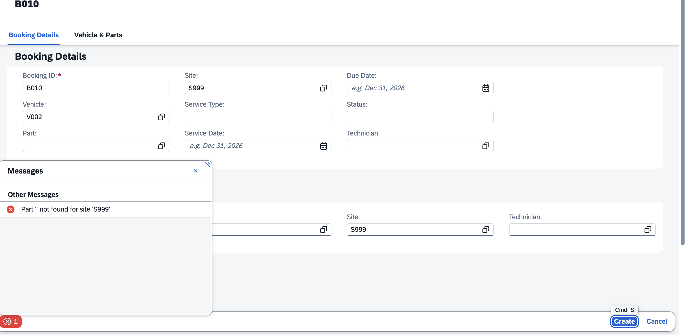
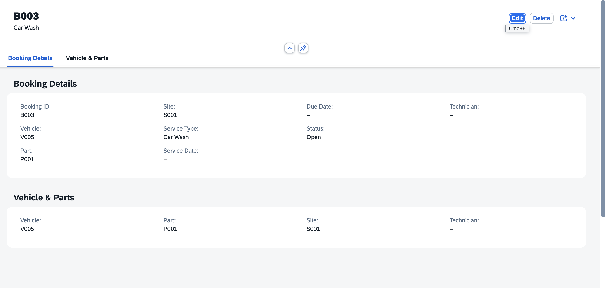
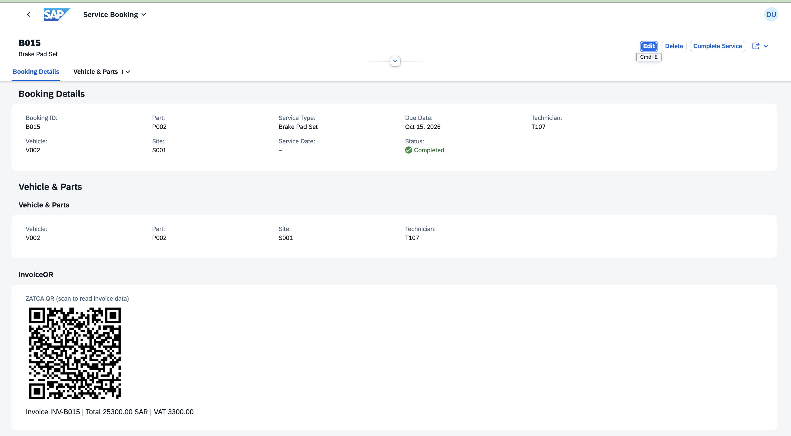

# Route 40 Motors — Service Booking & Aftersales Platform

An automotive aftersales application built on **SAP BTP ABAP Environment** with the **ABAP RESTful Application Programming Model (RAP)**, **CDS** and **SAP Fiori Elements**.

Route 40 Motors models a multi-site car workshop. A customer's vehicle is booked for service, each booking reserves a spare part at a specific site, and the back end refuses the booking if that part is not in stock at that site. When a service is completed, the app creates an invoice with a ZATCA-style QR code (TLV, Base64). The project also tracks parts deliveries and includes a Saudization (Nitaqat-style) workforce report, reflecting the Saudi market it is themed on.

> Sample data in this repository is fictional.

**Demo video (2 min):** [Watch on YouTube](https://youtu.be/Lkluje2rYjA)

**Author:** Sharfunisa Shajahan · [GitHub](https://github.com/Nishaweb-developer) · [Portfolio](https://nishaweb-developer.github.io/myworks)

---

## What it does

- **Service bookings**: list report and object page with create, edit and delete.
- **Stock validation**: a server-side validation (`checkStock`) blocks a booking when the part does not exist at the chosen site or is out of stock, on both create and edit.
- **Input normalisation**: part, site and technician IDs are converted to upper case before validation, so `p001` and `P001` behave the same.
- **Complete Service action**: completes a booking and creates an invoice record in `ZINVOICE` (net amount, 15% VAT, total in SAR). A completed booking cannot be completed again.
- **Invoice QR code**: a ZATCA-style QR (TLV, Base64) is generated by `ZCL_ZATCA_TLV` and drawn on the booking object page.
- **Master data**: vehicles, sites, spare parts (stock is kept per part and per site), technicians.
- **Deliveries**: purchase-order quantity, delivered quantity and open quantity per delivery, with a *Receive Remaining* action.
- **Saudization report**: share of Saudi technicians per department, with a colour band.

## Architecture

Every entity follows the same RAP layering:

```
Database table              ZSVCBOOKING, ZSPAREPART, ZVEHICLE, ZSITE, ZTECHNICIAN, ZDELIVERY, ZINVOICE
      |
Interface view  ZI_*        + behavior definition + behavior pool ZBP_I_* (validations, actions)
      |
Projection view ZC_*        + metadata extension ZME_* (Fiori list and object page layout)
      |
Service definition          ZSD_SVCBOOKING
      |
Service binding             ZSB_SVCBOOKING_V2  (OData V2 - UI)
      |
Fiori Elements app          List Report + Object Page (+ custom InvoiceQR section)
```

Supporting classes:

| Class | Purpose |
| ----- | ------- |
| `ZCL_ZATCA_TLV` | Builds the TLV byte structure and Base64 string for the invoice QR, with an ABAP Unit test class that checks the output against a reference value |
| `ZCL_SEED_*` | Loads fictional sample data |


## Data model

| Table         | Purpose                                                                  | Linked to                            |
| ------------- | ------------------------------------------------------------------------ | ------------------------------------ |
| `ZSVCBOOKING` | One service job: vehicle, part, site, technician, dates, status          | Vehicle, SparePart, Site, Technician |
| `ZVEHICLE`    | Customer vehicles                                                        | Booking                              |
| `ZSPAREPART`  | Stock per part **and** site (key `PART_ID` + `SITE_ID`), price, currency | Booking, Delivery                    |
| `ZSITE`       | Workshop locations                                                       | Booking, Delivery, SparePart         |
| `ZTECHNICIAN` | Technicians: name, nationality, department, join date                    | Booking, Saudization report          |
| `ZDELIVERY`   | Incoming parts against a PO                                              | SparePart, Site                      |
| `ZINVOICE`    | Invoice per completed service: number, amounts, VAT, QR text             | Booking                              |

## Stock validation (`checkStock`)

The validation runs on save. It looks up the part at the booking's site in `ZSPAREPART` and reports an error on the booking if the row is missing or the quantity is zero.

```abap
" Simplified from the behavior pool ZBP_I_SVCBOOKING
SELECT SINGLE qty_stock FROM zsparepart
  WHERE part_id = @booking-PartId
    AND site_id = @booking-SiteId
  INTO @DATA(qty).

IF sy-subrc <> 0.
  " failed + reported: "Part '<id>' not found for site '<site>'"
ELSEIF qty = 0.
  " failed + reported: "Part is out of stock"
ENDIF.
```

### Test results

| Scenario                                                     | Result                                                  | Evidence |
| ------------------------------------------------------------ | ------------------------------------------------------- | -------- |
| Part with stock at the site (P001 / S001)                    | Saves, row written to `ZSVCBOOKING`                     | [](screenshots/09-booking-saved-db.png) |
| Part with zero stock at the site (P002 / S002)               | Blocked: *Part is out of stock*                         | [](screenshots/03-out-of-stock-create.png) |
| Unknown part (P999 / S001)                                   | Blocked: *Part 'P999' not found for site 'S001'*        | [](screenshots/04-part-not-found.png) |
| Unknown site (P001 / S999)                                   | Blocked: *Part 'P001' not found for site 'S999'*        | [](screenshots/05-site-not-found.png) |
| Empty part                                                   | Blocked: *Part '' not found for site 'S999'*            | [](screenshots/06-empty-part.png) |
| Edit an existing booking and move it to a site with no stock | Blocked on save: *Part is out of stock*                 | [](screenshots/08-out-of-stock-on-edit.png) |
| Lowercase input (`p001`)                                     | Normalised to `P001` and validated normally             | [](screenshots/07-case-sensitive.png) |

### Booking object page



## Complete Service and invoice QR

The *Complete Service* action finishes a booking and writes an invoice to `ZINVOICE`. For example, a net amount of 22,000.00 SAR plus 15% VAT of 3,300.00 SAR gives a total of 25,300.00 SAR (invoice `INV-B015`).

The QR text is built by `ZCL_ZATCA_TLV` as a TLV structure (tag, length, value) and then Base64-encoded. The tags hold seller name, VAT registration number, timestamp, invoice total and VAT amount. The booking object page then draws the QR picture in a custom section (`InvoiceQR`) built with QRCode.js in an SAP Business Application Studio Fiori project.



A booking can only be completed once. Trying again shows *Booking is already completed* and no second invoice is created.


**Scope:** this is a ZATCA-style QR for demonstration. It shows how the TLV format works and how to render it in Fiori. It does not submit invoices to any tax authority, and the seller and VAT numbers in the sample data are fictional.

## Deliveries

Each delivery shows the PO quantity, delivered quantity and open quantity, and offers a *Receive Remaining* action.


## Saudization report

Saudization is Saudi Arabia's policy of raising the share of Saudi nationals in private-sector employment, and **Nitaqat** is the program that measures it and assigns companies a colour band. This report calculates, per department:

```
Saudization % = Saudi technicians / total technicians x 100
```

It is built as three stacked CDS view entities (counts, percentage, band), projected as `ZC_SaudiBand`, exposed as the `SaudiBand` entity, and shown in a Fiori Elements list report with criticality colours.


**Important:** the bands (Red, Low Green, Mid Green, High Green, Platinum) use **illustrative cut-offs** (below 10, 20, 30 and 40 percent, then Platinum), not official Nitaqat thresholds. Real Nitaqat is calculated for a whole establishment, by sector and company size, not per department. The per-department view is a simplification for this demo.

## Tech stack

- SAP BTP ABAP Environment (ABAP Cloud)
- RAP managed scenario: behavior definitions, validations, actions, `strict ( 2 )`
- CDS view entities, projection views, metadata extensions
- OData V2 service definition and binding (UI)
- SAP Fiori Elements (list report and object page) with a custom section
- ABAP Unit (TLV class)
- ABAP Development Tools (Eclipse), SAP Business Application Studio, abapGit

## Run it yourself

1. Install the abapGit plugin in ADT and link this repository to a package in your ABAP Environment system, then **Pull**.
2. Activate all objects.
3. Run the seed classes (`ZCL_SEED_*`) with `F9` to load sample vehicles, sites, parts, bookings and technicians.
4. Open the service binding `ZSB_SVCBOOKING_V2`, publish it, select an entity (for example `SvcBooking`) and click **Preview**.

## Known limitations

- The stock check validates but does not reduce stock, so a booking does not deduct quantity yet.
- No authorization checks or draft handling yet.
- Saudization bands are illustrative (see above).
- The invoice QR is for demonstration only (see scope note above).

## Roadmap

The order is deliberate: finish and test the core application first, then integration, then the experimental features. A solid, explainable project comes before a flashy one.

**Phase 1 — Core quality (in progress)**
- [x] Stock validation (`checkStock`) on create and edit
- [x] Upper-case input normalisation
- [x] Complete Service action with invoice and TLV QR
- [x] ABAP Unit test for the TLV class
- [ ] Stock deduction on booking, with locking so two users cannot take the last part
- [ ] Authorization (access control) and draft handling
- [ ] ABAP Unit tests for `checkStock` and Complete Service
- [ ] Technician assignment warning when a hire would lower a department's Saudization ratio

**Phase 2 — Integration**
- [ ] Booking-completed business event picked up by an SAP Cloud Integration flow that sends a "your car is ready" email
- [ ] Classic ALV companion report on an on-premise system
- [ ] Cloud Connector, RFC and IDoc scenario

**Phase 3 — Experimental (only after Phases 1 and 2)**
- [ ] **AI service advisor:** the customer describes the problem, the model suggests a summary, urgency and part, and `checkStock` validates the suggestion. The model can only choose from the real parts catalog, and a human confirms before the booking is saved. No customer names or phone numbers are sent in prompts, and each request and response is logged.
- [ ] **WhatsApp notification:** the "your car is ready" message is also sent over WhatsApp through the integration flow, using a sandbox account and no real customer data.
- [ ] **MCP server:** expose the booking service to an AI assistant so a user can ask it to book a service. Exploratory, and depends on current SAP support.
